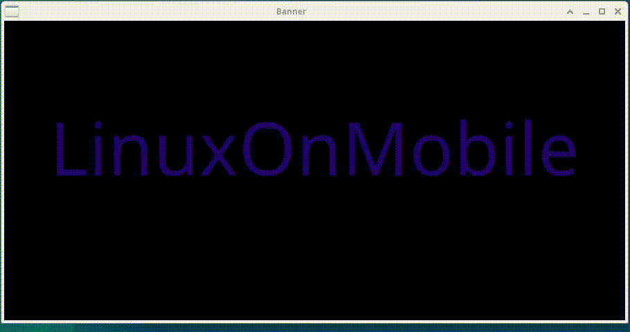

# Simple app to display a banner on screen

**Features**

- Displays custom text
    - Any number of lines
    - With animation
    - Within a specific amount of time

**Technical**

- Written in Qt and Qml
- Small and effective
- Runs also on mobile
    - Currently only tested on 

**Demo of running app on Desktop**

**Build for Desktop**

- Clone repository
- cmake -S . -B build
- cmake --build build

**Build for postmarketOS**

- Clone repository
- Generate archive
    - ./create_archive.sh
- Create new directory for app in (...pmosbase)/edge/main/banner
    - pmbootstrap newapkbuild banner
- Copy archive and APKBUILD into created directory
    - cp banner-1.0.0.tar.bz2 APKBUILD (...pmosbase)/edge/main/banner
- Build package
    - pmbootstrap build banner --arch aarch64
- Transfer to mobile
    - pmbootstrap.py sideload banner --arch=aarch64 --install-key --host (ip-address)

